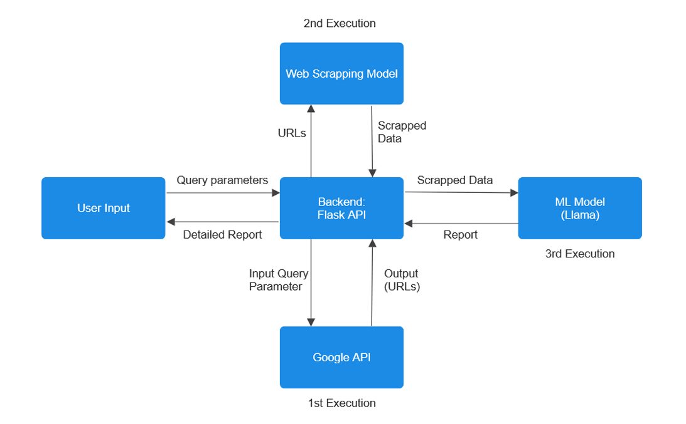

# AI Powered Competitive Intelligence Solution for Croma
<hr>

## Prerequisites
- Python 3.x
- Node.js and npm
- Docker (if using Docker)

## Installation

### Manual setup

1. Clone the repository:
 ```bash
 git clone https://github.com/Adityadln/CromaTF24.git
```
2. Setting up virtual env for backend
```bash
cd Server
python -m venv venv
source venv/bin/activate 
```
3. Running the backend
```bash
pip install -r requirements.txt
flask run
```
4. Setting up the frontend
```bash
cd client
npm install
npm run dev
```
5. Setting up the backend
```bash
cd models
pip install -r requirements.txt
```
### Docker setup
1. Building and running container
```bash
docker-compose up --build
```

2. Application accessible at
```bash
http://localhost:5173
```
<hr>

## Website Preview

<hr>

## The Architecture


<hr>

## Known Issues
- As of now the backend and frontend segment and web scraping and model work together but there is some still some fixes to be made between the backend and the scraping logic.
- The insights derived by the model is yet to be rendered on the front end


